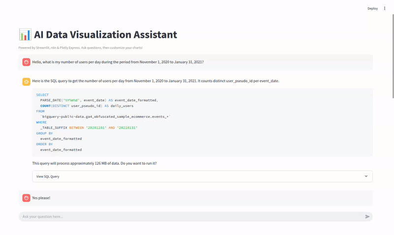
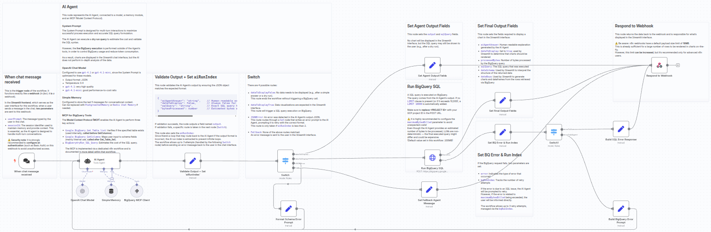
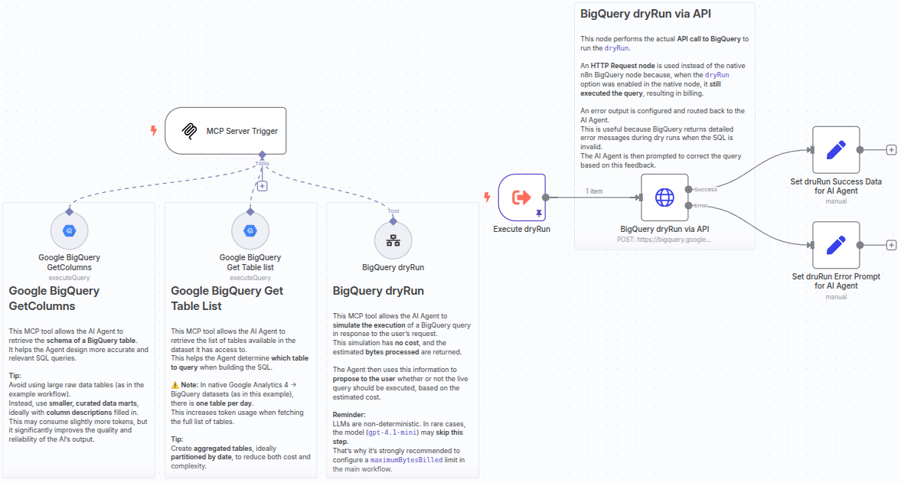

# AI DataViz Assistant with n8n & Streamlit

This repository provides a ready-to-use AI-powered data visualization assistant. Ask your questions in natural language and receive interactive charts in response, instantly!

- **Backend**: Powered by two [n8n](https://n8n.io/) workflows  
- **Frontend**: Built with [Streamlit](https://streamlit.io/)  
- **Optimized for**: `gpt-4.1` and `gpt-4.1-mini`  
- **Use case**: Ideal for exploring datasets like Google Analytics' public BigQuery samples

> 💡 The AI simulates BigQuery queries using `dryRun` mode to estimate costs and asks for user confirmation before running live queries.



---

## ⚠️ Security Warning

When deploying this assistant, **do not make the app public**. Enable [authentication](https://docs.streamlit.io/develop/concepts/connections/authentication) to restrict access and protect your credentials.

---

## Main Workflow: AI Agent in n8n

This n8n workflow defines the conversational AI logic with System Prompt optimized for multi-turn interactions. The workflow is documented directly inside the n8n UI.



### Features:
- Error handling with retry logic (max 3 loops)
- BigQuery requests include `maximumBytesBilled` to avoid surprise billing
- Uses `Simple Memory` node to maintain context across turns
- Strong performance with `gpt-4.1`, good fallback with `gpt-4.1-mini`
- Recommended: [Connect BigQuery using OAuth2 in n8n](https://docs.n8n.io/integrations/builtin/credentials/google/)

---

## MCP Workflow: Agent Tools Access

This secondary workflow enables the AI agent to call external tools via the Model Context Protocol (MCP).



### Available Tools:
- **BigQuery Table List**: Lists available tables for schema discovery
- **BigQuery Get Columns**: Retrieves table schemas for SQL generation
- **BigQuery DryRun**: Simulates queries to estimate cost and validate syntax

---

## Streamlit

⚠️ The Streamlit code was entirely generated by `Gemini 2.5 Pro`. Make sure to review it if you prefer not to rely on code fully produced by a language model.

### 🔐 Credentials Setup

Copy and rename the example secrets file:
```bash
cp .streamlit/secrets-example.toml .streamlit/secrets.toml
```

Fill in your n8n credentials:
```toml
[n8n]
webhook_url = "<your-webhook-url>"
username = "<your-n8n-username>"
password = "<your-password>"
```

> The `.gitignore` protects this file from being committed — but **never share your credentials**.

---

### Requirements

Install required dependencies:
```bash
pip install -r requirements.txt
```

`requirements.txt` should include:
```
streamlit==1.45.1
plotly==6.0.1
```

---

### Launch the App

Run the frontend locally:
```bash
streamlit run app.py
```

Make sure the n8n workflows are active before initiating a conversation.

---

## Data Warehouse Setup

In the n8n workflows shared in this repository, the data warehouse used is Google BigQuery.

You can test this assistant with the public BigQuery dataset:  
`bigquery-public-data.ga4_obfuscated_sample_ecommerce.events_*`  
[Dataset documentation](https://developers.google.com/analytics/bigquery/web-ecommerce-demo-dataset)

### Best Practices:
- Set `maximumBytesBilled` to avoid unexpected charges
- Prefer aggregated, partitioned datasets without PII
- Add column descriptions to help the assistant generate SQL

---

## Limitations

- **Max 16MB JSON payload** in n8n (limits BigQuery results to ~10,000 rows)
- **Conversational, not analytical**: The assistant doesn't analyze full result sets, it focuses on building SQL and generating the right chart.

---
